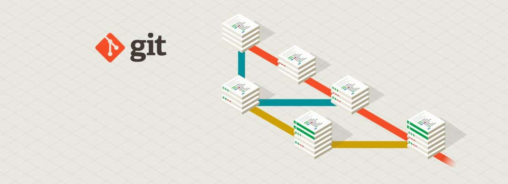
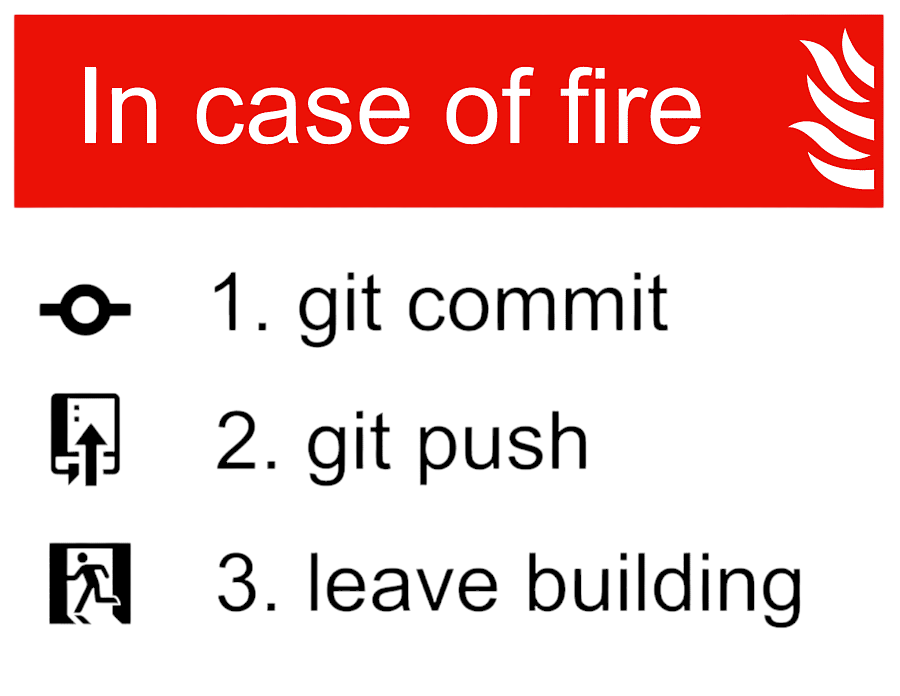

# Workshop Git 🚀

  

## 📖 Overview

This is a comprehensive Git workshop designed to introduce developers to Git version control system. The workshop covers essential concepts, commands, and best practices for effective Git usage in both individual and team environments.

**Note: The workshop and slides are in Italian.**

## 🔗 Resources

  <b>🎬 <a href="https://youtu.be/QbXAskIENVM">Watch full workshop recording on YouTube</a> </b> (in Italian)

  <b>📊 <a href="https://zakantonio.github.io/workshop-git/">Explore the interactive presentation</a></b> (in Italian)

## 🔍 Workshop Content

The workshop covers a wide range of Git topics including:

- 📁 Basic Git concepts (Repository, Working Directory, Staging Area, Commits)
- ⌨️ Essential Git commands
- 🌿 Branching and merging strategies
- 🌐 Remote collaboration with GitHub, GitLab, and BitBucket
- 🔧 Advanced commands (Rebase, Reset, Revert)
- 💡 Tips and tricks (Cherry-pick, Patch, Stash, Blame)
- ✅ Best practices and workflows

## 🔗 Additional Resources
In the slides you will find links to additional resources for further learning:
- 📚 Official Git documentation
- 📝 Git cheat sheets
- 🙈 .gitignore templates
- 🎮 Interactive Git learning platforms
- 🖥️ GUI tools for Git

## 🚀 Getting Started

To get the most out of this workshop:

1. Watch the [workshop recording](https://youtu.be/QbXAskIENVM)
2. Follow along with the [interactive slides](https://zakantonio.github.io/workshop-git/)
3. Practice the commands and scenarios presented in the workshop

## 📜 License

This workshop material is available for educational purposes.

---

  

*Note: This workshop was created to help developers understand and effectively use Git for version control in their projects.* ⭐